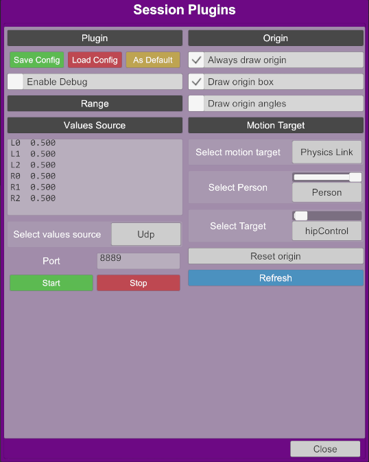

    <h1>BusDriver</h1>
     
    

 

# About

BusDriver is a VaM (Virt-a-Mate) plugin that accepts motion data from various sources and animates selected target in the scene.

# Features

* Accepts data from UDP server
* Supports TCode data format
* Animates target using Physics Link or Force